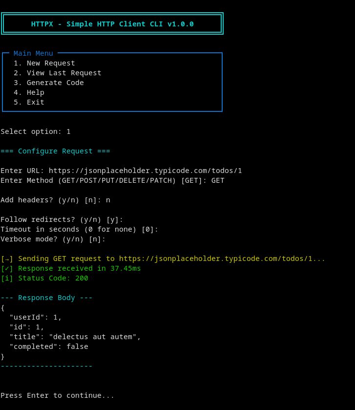

# HTTPX



A command-line HTTP client built in C with libcurl. Make HTTP requests and generate code snippets.

## Features

- Support for all HTTP methods (GET, POST, PUT, DELETE, PATCH)
- Custom headers
- Colored output
- Response time measurement
- JSON formatting
- Code generation for cURL, JavaScript, Python, Rust, Java

## Installation

### Prerequisites

Install libcurl:

**Ubuntu/Debian:**
```bash
sudo apt-get install libcurl4-openssl-dev
```

**Fedora/RHEL:**
```bash
sudo dnf install libcurl-devel
```

**macOS:**
```bash
brew install curl
```

### Build

```bash
make
./httpx
```

## Usage

Run `./httpx` and follow the menu to make requests or generate code.

For requests: Enter URL, method, headers, body (end multiline with `@@@`).

## Tips

- JSON requests auto-add Content-Type header
- End multiline body with `@@@` on new line
- Enable verbose mode for details

## License

MIT
